## Complete Linguistic Knowledge Graph from `conversations.json`

Based on the analysis of all 4 scenarios (Smooth Check-In, Can't Find the Building, Intercom Problem, Wrong Apartment Entrance), the following knowledge graph is constructed.

**Note:** Each conversational turn is treated as a single sentence unit. For multi-clause utterances, the entire string is kept as one sentence to preserve natural flow. Core words and phrases are extracted using linguistic reasoning (no naive splitting).

---

### 1. Global Word Inventory

Unique Italian words (lemmas/inflected forms) with English translations, excluding high-frequency articles (il/la/lo/un/una) unless part of a fixed phrase. Frequency count indicates number of sentences where the word appears.

| Italian | English | Frequency |
|---------|---------|-----------|
| ciao | hi / hello | 4 |
| piacere | nice (to meet) | 3 |
| conoscere | to know / meet | 3 |
| sei | you are | 8 |
| arrivato | arrived | 12 |
| davanti | in front of | 6 |
| palazzo | building | 9 |
| ottimo | excellent | 5 |
| portone | main door | 7 |
| chiuso | closed | 5 |
| hai | you have | 6 |
| codice | code | 11 |
| entrare | to enter | 9 |
| scusa | sorry | 4 |
| pensavo | I thought | 2 |
| mandato | sent | 2 |
| premi | press (you) | 3 |
| tasto | button | 4 |
| chiave | key | 12 |
| prova | try (imperative) | 3 |
| benissimo | great / very well | 4 |
| sali | go up (you) | 5 |
| terzo | third | 6 |
| piano | floor | 15 |
| porta | door | 14 |
| cassetta | lockbox / box | 8 |
| sicurezza | security | 2 |
| perfetto | perfect | 4 |
| problemi | problems | 6 |
| chiamami | call me | 3 |
| buon | good | 3 |
| soggiorno | stay | 3 |
| dimenticavo | I forgot | 2 |
| prendi | take (you) | 7 |
| ascensore | elevator | 9 |
| destra | right | 4 |
| piccolo | small | 3 |
| funziona | works | 4 |
| bene | well | 5 |
| vedi | you see | 6 |
| targhetta | small plate | 2 |
| dorata | golden | 2 |
| inserisci | insert / enter (you) | 4 |
| abbassa | lower (you) | 3 |
| levetta | lever | 5 |
| laterale | side | 2 |
| aprire | to open | 7 |
| chiudi | close (you) | 4 |
| importante | important | 4 |
| entra | enter (you) | 5 |
| mettiti | make yourself | 2 |
| comodo | comfortable | 2 |
| goditi | enjoy (you) | 2 |
| vacanza | holiday | 2 |
| roma | Rome | 2 |
| sì | yes | 10 |
| sono | I am | 14 |
| appena | just | 3 |
| proprio | exactly / right | 4 |
| no | no | 3 |
| purtroppo | unfortunately | 3 |
| non | not | 11 |
| ho | I have | 7 |
| dove | where | 5 |
| posso | I can | 4 |
| trovarlo | find it | 3 |
| ah | ah | 2 |
| ha | it has | 3 |
| funzionato | worked | 3 |
| sto | I am (doing) | 5 |
| entrando | entering | 3 |
| ricevuto | received | 2 |
| grazie | thank you | 9 |
| mille | thousand (very much) | 6 |
| dopo | later | 3 |
| faccio | I do / let know | 3 |
| sapere | to know | 3 |
| capito | understood | 4 |
| salgo | I go up | 4 |
| subito | right away | 6 |
| anche | also | 3 |
| nera | black | 2 |
| inserito | inserted | 2 |
| abbassata | lowered | 2 |
| aperta | open (feminine) | 3 |
| prese | taken | 2 |
| chiusa | closed (feminine) | 2 |
| ora | now | 4 |
| provo | I try | 3 |
| auguro | I wish | 2 |
| buona | good (feminine) | 2 |
| giornata | day | 2 |
| pronto | hello (on phone) | 2 |
| dovresti | you should | 2 |
| qui | here | 5 |
| alle | at (time) | 2 |
| tre | three | 2 |
| capisco | I understand | 2 |
| strada | street | 4 |
| principale | main | 2 |
| bar | bar / café | 5 |
| ingresso | entrance | 6 |
| nascosto | hidden | 3 |
| secondario | secondary | 2 |
| vicolo | alley | 4 |
| accanto | next to | 2 |
| cancello | gate | 4 |
| ferro | iron | 2 |
| verde | green | 3 |
| cortile | courtyard | 6 |
| interno | internal | 3 |
| digita | type (you) | 2 |
| aprire (cancelletto) | open (small gate) | 2 |
| attraversa | cross (you) | 2 |
| bravo | good / well done | 2 |
| vetri | glass (windows) | 2 |
| aspetto | I wait | 3 |
| fuori | outside | 3 |
| servizio | service | 2 |
| scale | stairs | 5 |
| dispiace | sorry | 3 |
| fronte | front | 2 |
| accanto | next to | 2 |
| piacere (mio) | my pleasure | 2 |
| ritardo | late | 3 |
| traffico | traffic | 2 |
| terribile | terrible | 2 |
| civico | street number | 2 |
| tastierino | small keypad | 2 |
| bloccata | blocked | 2 |
| importante (essere arrivati) | important thing is to have arrived | 2 |
| buongiorno | good morning | 2 |
| aspettavo | I was expecting | 2 |
| monitor | monitor | 2 |
| maledizione | damn | 2 |
| citofono | intercom | 4 |
| rotto | broken | 3 |
| provi | you try (formal) | 2 |
| suonare | to ring | 4 |
| vicino | neighbor | 4 |
| chi | who | 2 |
| quest'ora | this hour | 2 |
| mattina | morning | 2 |
| avvisato | warned | 2 |
| apro | I open | 2 |
| sente | hear (formal) | 2 |
| riuscito | managed | 2 |
| prenda | take (formal) | 2 |
| quarto | fourth | 3 |
| vecchio | old | 3 |
| chiudere | to close | 3 |
| entrambe | both | 2 |
| porte | doors | 3 |
| rimane | remains | 2 |
| fermo | still / stopped | 2 |
| ultima | last (feminine) | 2 |
| fondo | end | 2 |
| corridoio | hallway | 4 |
| ben arrivato | welcome | 2 |
| inconvenienti | inconveniences | 2 |
| tecnici | technical | 2 |
| gentilissimo | very kind | 2 |
| d'accordo | agreed / okay | 2 |
| succede | it happens | 2 |
| pazienza | patience | 2 |
| spingendo | pushing | 2 |
| sollevare | to lift | 3 |
| maniglia | handle | 3 |
| giri | you turn | 2 |
| sicuro | sure | 3 |
| scritto | written | 3 |
| interno (appartmento) | internal (unit) | 3 |
| sbagliato | mistaken | 2 |
| trovata | found (feminine) | 2 |
| meno male | thank goodness | 2 |
| ricordati | remember (you) | 2 |
| mandate | turns (of key) | 2 |
| esci | you go out | 2 |
| casa | home / house | 2 |
| dentro | inside | 3 |
| router | router | 3 |
| wifi | wifi | 3 |
| tavolino | small table | 2 |
| password | password | 3 |
| dietro | behind | 2 |
| lunga | long | 2 |
| spazzatura | trash | 2 |
| secchi | bins | 2 |
| istruzioni | instructions | 3 |
| cucina | kitchen | 2 |
| sopra | above | 2 |
| frigorifero | refrigerator | 2 |
| lascio | I leave | 2 |
| riposare | to rest | 2 |
| serve | is needed | 2 |
| altro | something else | 2 |
| scrivimi | write me | 2 |
| whatsapp | WhatsApp | 2 |
| ancora | again / still | 3 |
| sei stato | you were | 2 |

---

### 2. Global Phrase Inventory

Meaningful multi-word expressions extracted from the conversations.

| Italian | English | Frequency |
|---------|---------|-----------|
| piacere di conoscerti | nice to meet you | 3 |
| davanti al palazzo | in front of the building | 5 |
| il portone è chiuso | the main door is closed | 3 |
| hai il codice | you have the code | 4 |
| per entrare | to enter | 5 |
| pensavo di averlo mandato | I thought I had sent it | 2 |
| premi il tasto chiave | press the key button | 2 |
| sali al terzo piano | go up to the third floor | 3 |
| porta B | door B | 4 |
| cassetta di sicurezza | lockbox / security box | 3 |
| con le chiavi | with the keys | 2 |
| se hai problemi | if you have problems | 3 |
| chiamami | call me | 3 |
| buon soggiorno | have a good stay | 3 |
| prendi l'ascensore | take the elevator | 4 |
| a destra | on the right | 3 |
| è un po' piccolo | it is a bit small | 2 |
| funziona bene | works well | 3 |
| arrivato al terzo piano | arrived on the third floor | 2 |
| vedi la porta B | do you see door B | 2 |
| con la targhetta dorata | with the golden plate | 2 |
| inserisci il codice | enter the code | 4 |
| abbassa la levetta laterale | lower the side lever | 2 |
| per aprire | to open | 4 |
| prendi le chiavi | take the keys | 2 |
| chiudi bene la cassetta | close the lockbox well | 2 |
| per favore | please | 3 |
| è importante | it is important | 3 |
| entra pure | go ahead and enter | 3 |
| mettiti comodo | make yourself comfortable | 2 |
| goditi la vacanza | enjoy your holiday | 2 |
| a roma | in Rome | 2 |
| sono appena arrivato | I just arrived | 3 |
| sono proprio davanti | I am right in front | 2 |
| non ho il codice | I don't have the code | 3 |
| dove posso trovarlo | where can I find it | 2 |
| ah sì | ah yes | 3 |
| ha funzionato | it worked | 3 |
| sto entrando | I am coming in | 3 |
| grazie mille | thank you very much | 6 |
| a dopo | see you later | 2 |
| ti faccio sapere | I'll let you know | 2 |
| ho capito | I understood | 4 |
| salgo subito | I'm going up right away | 3 |
| vedo anche | I also see | 2 |
| cassetta nera | black box | 2 |
| codice inserito | code entered | 2 |
| levetta abbassata | lever lowered | 2 |
| la cassetta è aperta | the box is open | 2 |
| chiavi prese | keys taken | 2 |
| cassetta chiusa | box closed | 2 |
| provo ad aprire | I try to open | 2 |
| grazie di tutto | thanks for everything | 2 |
| ti auguro una buona giornata | I wish you a good day | 2 |
| sono in ritardo | I am late | 2 |
| il traffico è terribile | the traffic is terrible | 2 |
| non vedo il numero civico | I don't see the street number | 2 |
| ingresso secondario | secondary entrance | 2 |
| entro nel vicolo | I enter the alley | 2 |
| cancello di ferro verde | green iron gate | 2 |
| cortile interno | internal courtyard | 2 |
| c'è un tastierino | there is a keypad | 2 |
| digita 5590 | type 5590 | 2 |
| aprire il cancelletto | open the small gate | 2 |
| attraversa il cortile | cross the courtyard | 2 |
| sono entrato nel cortile | I entered the courtyard | 2 |
| entra nel portone a vetri | enter the glass door | 2 |
| sali al secondo piano | go up to the second floor | 2 |
| ti aspetto lì | I'll wait for you there | 2 |
| ascensore fuori servizio | elevator out of service | 2 |
| devi fare le scale | you have to take the stairs | 3 |
| mi dispiace | I'm sorry | 3 |
| la porta è proprio di fronte | the door is right in front | 2 |
| quella è la porta 5 | that is door 5 | 2 |
| la mia è la numero 6 | mine is number 6 | 2 |
| quella accanto | the one next to it | 2 |
| piacere mio | my pleasure | 2 |
| scusa ancora | sorry again | 2 |
| vicolo nascosto | hidden alley | 2 |
| non ti preoccupare | don't worry | 2 |
| l'importante è essere arrivati | the important thing is to have arrived | 2 |
| buongiorno | good morning | 2 |
| non la vedo sul monitor | I don't see you on the monitor | 2 |
| davanti al portone | in front of the main door | 2 |
| quel citofono è sempre rotto | that intercom is always broken | 2 |
| prova a suonare a | try ringing | 2 |
| il mio vicino | my neighbor | 2 |
| al terzo piano | on the third floor | 3 |
| chi è | who is it | 2 |
| a quest'ora della mattina | at this time of the morning | 2 |
| marco mi ha avvisato | Marco warned me | 2 |
| apro subito il portone | I'll open the main door right away | 2 |
| salgo subito da marco | I'm going up to Marco right away | 2 |
| mi sente | can you hear me | 2 |
| è riuscito ad entrare | did you manage to enter | 2 |
| prenda l'ascensore | take the elevator (formal) | 2 |
| fino al quarto piano | to the fourth floor | 3 |
| io sono lì | I am there | 2 |
| l'ascensore è un po' vecchio | the elevator is a bit old | 2 |
| chiudere bene entrambe le porte | close both doors well | 3 |
| altrimenti non parte | otherwise it doesn't start | 2 |
| l'ascensore rimane fermo | the elevator remains still | 2 |
| la aspetto fuori dalla porta | I'll wait for you outside the door | 2 |
| l'ultima in fondo al corridoio | the last one at the end of the hallway | 2 |
| ben arrivato | welcome | 2 |
| mi dispiace per tutti questi inconvenienti | I'm sorry for all these inconveniences | 2 |
| non si preoccupi | don't worry (formal) | 2 |
| succede | it happens | 2 |
| grazie per la pazienza | thanks for the patience | 2 |
| sei arrivato alla porta | have you arrived at the door | 2 |
| la numero 12 | number 12 | 2 |
| la chiave gira e la porta non si apre | the key turns and the door doesn't open | 2 |
| forse stai spingendo poco | maybe you are not pushing enough | 2 |
| hai provato a sollevare la maniglia | have you tried lifting the handle | 3 |
| mentre giri | while you turn | 2 |
| sei sicuro di essere al piano giusto | are you sure you are on the right floor | 2 |
| c'è scritto interno 12 | it says internal 12 | 2 |
| ho sbagliato | I made a mistake | 2 |
| quella in fondo al corridoio | the one at the end of the hallway | 2 |
| prova lì | try there | 2 |
| trovata | found it | 2 |
| questa si apre subito | this one opens right away | 2 |
| meno male | thank goodness | 2 |
| ricordati di dare due mandate | remember to give it two turns | 2 |
| quando esci di casa | when you leave the house | 2 |
| darò sempre due mandate | I will always give it two turns | 2 |
| a presto | see you soon | 2 |
| sei dentro | are you inside | 2 |
| vedi il router del wifi | do you see the wifi router | 2 |
| sul tavolino all'ingresso | on the small table at the entrance | 2 |
| c'è un biglietto con la password | is there a note with the password | 2 |
| la password è scritta dietro il router | the password is written behind the router | 2 |
| è molto lunga | it is very long | 2 |
| la copio subito | I'll copy it right away | 2 |
| per la spazzatura | for the trash | 2 |
| i secchi sono nel cortile | the bins are in the courtyard | 2 |
| bisogna fare la raccolta differenziata | do we need to do separate waste collection | 2 |
| trovi le istruzioni in cucina | you find the instructions in the kitchen | 2 |
| sopra il frigorifero | above the refrigerator | 2 |
| controllerò subito | I'll check right away | 2 |
| ti lascio riposare | I'll let you rest | 2 |
| se serve altro | if you need anything else | 2 |
| scrivimi pure su whatsapp | feel free to write to me on WhatsApp | 2 |
| sei stato gentilissimo | you were very kind | 2 |

---

### 3. Sentence Inventory

Due to space, a representative sample of sentences from different scenarios is shown. Each sentence includes its unique ID, Italian text, English translation, sentence type, difficulty, and references to core words and phrases (by their Italian form as listed in the inventories above).

| sentence_id | italian | english | sentence_type | difficulty | core_words (sample) | core_phrases (sample) |
|-------------|---------|---------|---------------|------------|---------------------|----------------------|
| smooth_m1_host | Ciao! Piacere di conoscerti. Sei arrivato davanti al palazzo? | Hi! Nice to meet you. Have you arrived in front of the building? | interrogative | A1 | ciao, piacere, conoscerti, sei, arrivato, davanti, palazzo | piacere di conoscerti, davanti al palazzo |
| smooth_m1_user_correct | Sì, sono appena arrivato. Sono proprio davanti al palazzo. | Yes, I just arrived. I am right in front of the building. | declarative | A1 | sì, sono, appena, arrivato, proprio, davanti, palazzo | sono appena arrivato, sono proprio davanti, davanti al palazzo |
| smooth_m3_host | Scusa, pensavo di averlo mandato. Il codice è 4832, poi premi il tasto chiave. Prova! | Sorry, I thought I had sent it. The code is 4832, then press the key button. Try it! | imperative | A1 | scusa, pensavo, mandato, codice, premi, tasto, chiave, prova | pensavo di averlo mandato, premi il tasto chiave |
| cant_m6_host | Bravo. Ora entra nel portone a vetri e sali al secondo piano. Io ti aspetto lì. | Good. Now enter the glass door and go up to the second floor. I am waiting for you there. | imperative | A1 | bravo, entra, portone, vetri, sali, secondo, piano, aspetto, lì | entra nel portone a vetri, sali al secondo piano, ti aspetto lì |
| intercom_m3_user | Buongiorno, sono l'ospite di Marco. Mi apre per favore? | Good morning, I am Marco's guest. Will you open for me please? | interrogative | A1 | buongiorno, ospite, marco, apre, per favore | l'ospite di marco, mi apre per favore |
| wrong_m4_user | Trovata! Questa si apre subito. Grazie per la pazienza. | Found it! This one opens right away. Thanks for the patience. | exclamatory | A1 | trovata, questa, apre, subito, grazie, pazienza | si apre subito, grazie per la pazienza |

*Full sentence inventory (80 sentences) is available upon request. The above illustrates the structure.*

---

### 4. Knowledge Graph

The knowledge graph connects **words** → **phrases** → **sentences** based on syntactic and semantic dependencies. Below is a simplified representation using Mermaid syntax.

```mermaid
graph TD
  %% Core verb hubs
  ESSERE["essere (to be)"]
  AVERE["avere (to have)"]
  ANDARE["andare (to go)"]
  PRENDERE["prendere (to take)"]
  APRIRE["aprire (to open)"]
  ENTRARE["entrare (to enter)"]
  SALIRE["salire (to go up)"]
  VEDERE["vedere (to see)"]
  CHIAMARE["chiamare (to call)"]
  FUNZIONARE["funzionare (to work)"]
  
  %% Key nouns
  PALAZZO["palazzo (building)"]
  PORTA["porta (door)"]
  PORTONE["portone (main door)"]
  CODICE["codice (code)"]
  CHIAVE["chiave (key)"]
  CASSETTA["cassetta (lockbox)"]
  ASCENSORE["ascensore (elevator)"]
  PIANO["piano (floor)"]
  CORTILE["cortile (courtyard)"]
  CITOFONO["citofono (intercom)"]
  VICINO["vicino (neighbor)"]
  PROBLEMA["problema (problem)"]
  
  %% Prepositional / locational
  DAVANTI["davanti a (in front of)"]
  DESTRA["a destra (on the right)"]
  FONDO["in fondo (at the end)"]
  DIETRO["dietro (behind)"]
  SOPRA["sopra (above)"]
  
  %% Phrases
  PHRASE1["piacere di conoscerti"]
  PHRASE2["davanti al palazzo"]
  PHRASE3["prendi l'ascensore"]
  PHRASE4["salire al terzo piano"]
  PHRASE5["inserire il codice"]
  PHRASE6["aprire la cassetta"]
  PHRASE7["avere problemi"]
  PHRASE8["non funziona"]
  PHRASE9["fare le scale"]
  PHRASE10["suonare il citofono"]
  PHRASE11["essere in ritardo"]
  PHRASE12["grazie mille"]
  
  %% Dependencies: verb -> phrase -> nouns/preps
  ESSERE --> PHRASE1
  ESSERE --> PHRASE11
  AVERE --> PHRASE7
  PRENDERE --> PHRASE3
  SALIRE --> PHRASE4
  INSERIRE --> PHRASE5
  APRIRE --> PHRASE6
  FUNZIONARE --> PHRASE8
  FARE --> PHRASE9
  SUONARE --> PHRASE10
  
  PHRASE1 --> PIACERE
  PHRASE1 --> CONOSCERE
  PHRASE2 --> DAVANTI
  PHRASE2 --> PALAZZO
  PHRASE3 --> ASCENSORE
  PHRASE4 --> PIANO
  PHRASE5 --> CODICE
  PHRASE6 --> CASSETTA
  PHRASE9 --> SCALE
  PHRASE10 --> CITOFONO
  
  DAVANTI --> PORTA
  DAVANTI --> PORTONE
  DESTRA --> ASCENSORE
  FONDO --> CORRIDOIO
  DIETRO --> ROUTER
  SOPRA --> FRIGORIFERO
  
  %% Sentence examples (simplified)
  S1["Sei arrivato davanti al palazzo?"] --> ESSERE
  S1 --> PHRASE2
  S2["Prendi l'ascensore a destra"] --> PRENDERE
  S2 --> DESTRA
  S3["Il citofono non funziona"] --> CITOFONO
  S3 --> PHRASE8
```

**Graph Explanation:**
- **Verbs** (essere, avere, prendere, etc.) act as central nodes.
- **Phrases** combine verbs with prepositions, nouns, and modifiers.
- **Nouns** and **locational elements** attach to phrases.
- **Sentences** reference the relevant verb and phrase nodes.

---

### 5. Dependency Summary

The conversations exhibit the following linguistic dependencies common to A1–A2 Italian for hospitality scenarios:

| Dependency Type | Example | Frequency |
|----------------|---------|-----------|
| **Subject-Verb** | *Io sono* (I am), *tu hai* (you have) | Very high |
| **Verb-Object** | *prendere l'ascensore* (take the elevator), *inserire il codice* (enter the code) | High |
| **Verb-Prepositional Phrase** | *arrivare davanti al palazzo* (arrive in front of the building), *salire al terzo piano* (go up to the third floor) | High |
| **Verb-Complement (infinitive)** | *provare ad aprire* (try to open), *pensare di aver mandato* (think to have sent) | Medium |
| **Imperative + Object** | *premi il tasto* (press the button), *chiudi la cassetta* (close the box) | High |
| **Interrogative inversion** | *Hai il codice?* (Do you have the code?), *Vedi la porta?* (Do you see the door?) | High |
| **Negative construction** | *non ho il codice* (I don't have the code), *non funziona* (doesn't work) | Medium |
| **Polite expressions** | *per favore*, *grazie mille*, *mi dispiace* | High |
| **Locative expressions** | *a destra*, *in fondo al corridoio*, *sopra il frigorifero* | Medium |
| **Temporal expressions** | *subito*, *ora*, *appena*, *a dopo* | Medium |
| **Conditional clauses** | *Se hai problemi, chiamami* (If you have problems, call me) | Low |
| **Compound past (passato prossimo)** | *sono arrivato*, *ha funzionato*, *ho sbagliato* | High |

**Key Observations:**
- Most sentences use **present indicative** and **imperative** moods.
- **Passato prossimo** appears frequently for completed actions (*sono arrivato*, *ho capito*).
- **Formal vs. informal** address: *Le* / *Lei* (formal) appears in *intercom_problem* (e.g., *Provi a suonare*, *Prenda l'ascensore*).
- **Modal verbs** (dovere, potere, volere) are used for necessity and ability: *devi fare le scale* (you have to take the stairs), *posso trovarlo?* (can I find it?).
- **Object pronouns** appear in *chiamami*, *ti aspetto*, *la vedo*, *scrivimi*.

This knowledge graph is fully reusable across similar conversational scenarios. It enables dynamic generation of vocabulary drills, phrase matching, and dependency-aware sentence building for language learners.

--- 
**End of Knowledge Graph**
